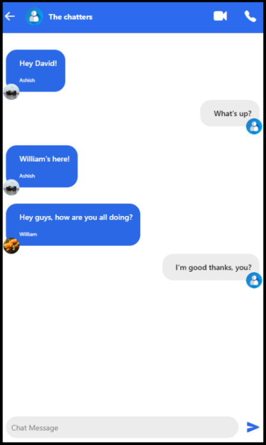

# Messaging_App
A messaging app that uses React Native, Expo, and Firebase Authentication and Database. It is hosted on github pages at [ashisha26.github.io/Messaging_App/](ashisha26.github.io/Messaging_App/). 

Apk is available [here](https://expo.dev/artifacts/eas/2uEZAfpt1Y56tmVyGacosw.apk) or in the releases page of this repo.




## Environment Setup

- On Windows, use the Anaconda prompt. 
- Useful VS Code extension: `ES7+ React/Redux/React-Native snippets`

```bash
conda create --name messaging_app 
conda activate messaging_app
conda install conda-forge::nodejs=20.9
npm install
npm install -g firebase-tools
npm install -g eas-cli
npm install -g @expo/ngrok@^4.1.0
npm install -g yarn
eas login
firebase login
yarn install # For Expo Android build
```

## Running
- `npm start`: Start app using expo. Can then select Android or Web
- `npm run android`: Directly start it on the Android emulator.
- `npm run remote_android`: Run Expo app via public URL, for Android device on a different network

## Deploying

Building the app as a SPA is automatically handled when deploying through the `npm` scripts.

### Deploying locally
- `npm run deploy_local`

### Deploying to Github Pages
- Add the following to `app.json` inside the `"expo"` object.
    ```json
    "experiments": {
      "baseUrl": "/Messaging_App"
    },
    ```
- `npm deploy_github`

### Deploying to Firebase hosting
- `npm run deploy_firebase`


### Building APK
```bash
eas update:configure
eas build:configure
eas build -p android --profile preview
```

## Notes

### Expo Go App
- Login into eas in cli, and on Android's Expo App.
- In order for it to work on Android on expo go, you need to either have the laptop and phone on the same wifi network, or use tunnelling. Then scan the QR code.
- `npm run remote_android` if Android and Laptop are not on the same network

### Android Emulator
- Run Android Emulator through Android Studio
- Run `npm start`, then press `a`. 
- may need `npx expo install --fix`

## Firebase Setup

```bash
firebase init
# Select "Hosting" option, and use these settings:
#? What do you want to use as your public directory? dist
#? Configure as a single-page app (rewrite all urls to /index.html)? Yes
#? Set up automatic builds and deploys with GitHub? No
```

## Issues
- icons don't work when hosted in firebase

## Links:
- [Youtube: Build React-native app](https://www.youtube.com/watch?v=MJzmZ9qmdaE)
- [Youtube: What is React Native?](https://www.youtube.com/watch?v=VozPNrt-LfE)
- [React Navigation](https://reactnavigation.org/docs/hello-react-navigation/)
- [Expo: Build APK](https://docs.expo.dev/build-reference/apk/)
- https://docs.expo.dev/eas-update/build-locally/
- https://dev.to/chinmaymhatre/how-to-generate-apk-using-react-native-expo-kae
- https://docs.expo.dev/eas-update/getting-started/
- [Expo app: Use tunnelling for public URL for Android](https://docs.expo.dev/more/expo-cli/#tunneling)
- https://reactnative.dev/docs/environment-setup?guide=native&package-manager=npm
    - Add `%LOCALAPPDATA%\Android\Sdk` as `ANDROID_HOME` environment variable
    - Add `%LOCALAPPDATA%\Android\Sdk\platform-tools` to `PATH`
- [How to publish to Firebase and Github Pages](https://docs.expo.dev/distribution/publishing-websites/)
